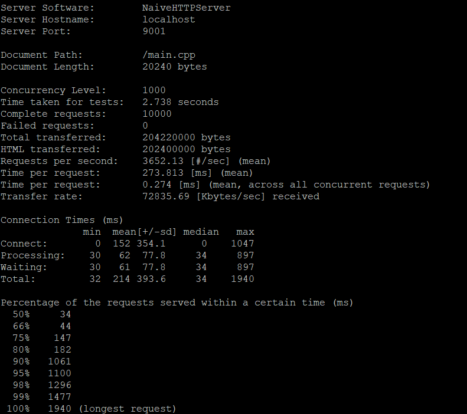
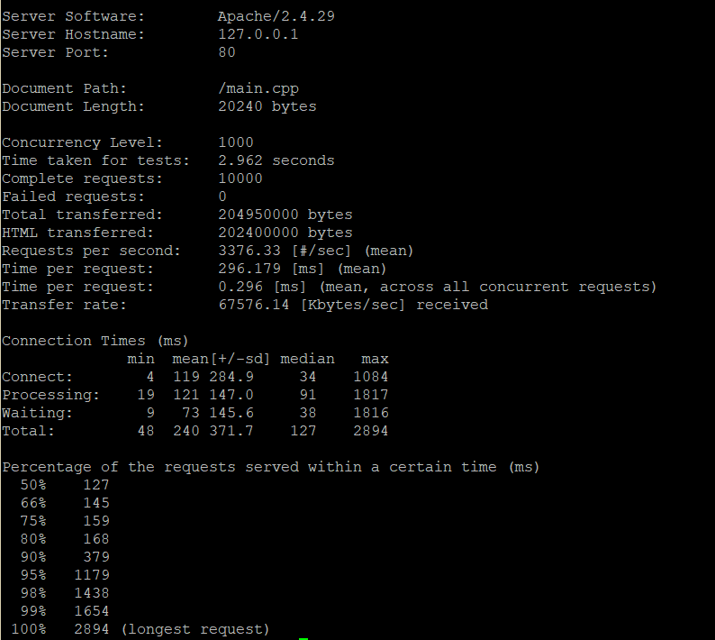

# HttpServer

A Modern C++ HTTP Serevr Implemention

用现代C++实现的一个http服务器

## 功能

**支持的HTTP方法**:

> GET
>
> POST (POST静态资源会返回405 Method Not Allowed)

**支持静态资源**, **支持Range请求头**, 数据压缩暂不支持.

**支持Lua作为[服务器端脚本](luacgi_maunal.md)执行**.

**Linux下可通过配置启动性能模式, 使用Epoll ET实现, [效率与Apache 2.4不相上下](#Benchmark)**

## 配置与使用

### 配置

端口号和服务器根目录支持动态指定, 默认端口是9001, 根目录是当前目录.

在启动文件夹下创建config.lua可以覆盖默认配置, 样例配置如下:

```lua
server_root="/home/kiritow"
server_port=9001
deploy_mode=1
```

其中deploy_mode=0时为默认配置,使用线程池处理连接. deploy_mode=1时在Linux下可启动为性能模式.

### 编译

Linux下: 调用`python build.py`进行编译. 编译输出文件为`main`.

Windows下: 如果安装并配置了g++可以使用`build.py`脚本进行编译. 否则需要建立VS项目.

## Benchmark

### NaiveHttpServer



### Apache 2.4 Linux

